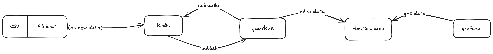

# work-log

This project is a real-time employee attendance tracking system. It collects entry/exit logs from a CSV file, processes them through a data pipeline.

## Project flow

## Technology Stack
- `Filebeat` monitors the CSV file and sends new log entries to Redis.

- `Redis` acts as a message broker, triggering events for new data.

- `Quarkus` listens to Redis events, processes the data, and indexes it in Elasticsearch.

- `Elasticsearch` stores and organizes the logs for fast searching and filtering.

- `Grafana` provides a dashboard to visualize attendance insights.